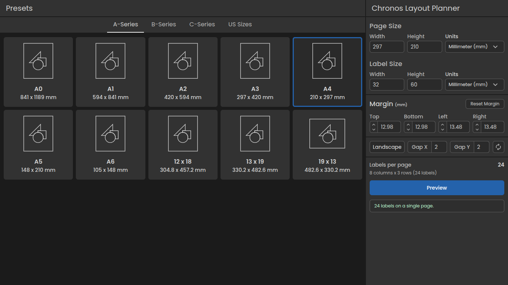
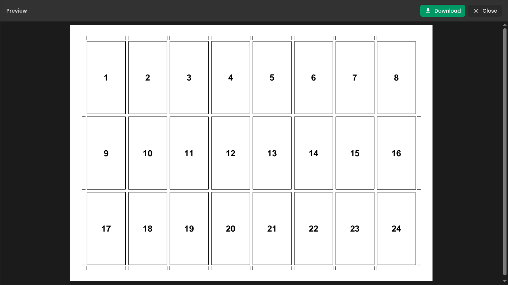

# Nyxen

### Print Layout Engine for Labels & Coupons

## Problem

Before Nyxen, every label job started the same way: we had to open a design tool, manually set the page size and label size, and then figure out how many labels would actually fit. That setup took time, made the workflow feel heavy, and added extra room for mistakes before printing even began.

## Solution

Nyxen turns that setup into a simple web workflow. You enter the page and label dimensions, and the app instantly calculates the layout, shows a live preview, and generates a PDF you can review and download. It makes label planning faster, clearer, and much easier to verify before sending anything to print.

## Features

- Live layout preview with automatic label count calculation
- Custom page size, label size, and spacing controls
- PDF generation with preview before download
- Supports portrait and landscape sheet layouts
- Helps you see exactly how many labels will fit on the page

## Tech Stack

- React 19
- Vite
- Tailwind CSS
- MUI and Emotion
- `@react-pdf/renderer`
- `pdf-lib`
- `@embedpdf/snippet`
- Framer Motion

## Screenshots

  
  

## Challenges You Solved

- Calculating how many labels fit based on page size, label size, and spacing
- Keeping the preview and exported PDF aligned with the same layout logic
- Making the workflow faster than opening external design software for every label job
- Supporting both preview and download in one simple flow
